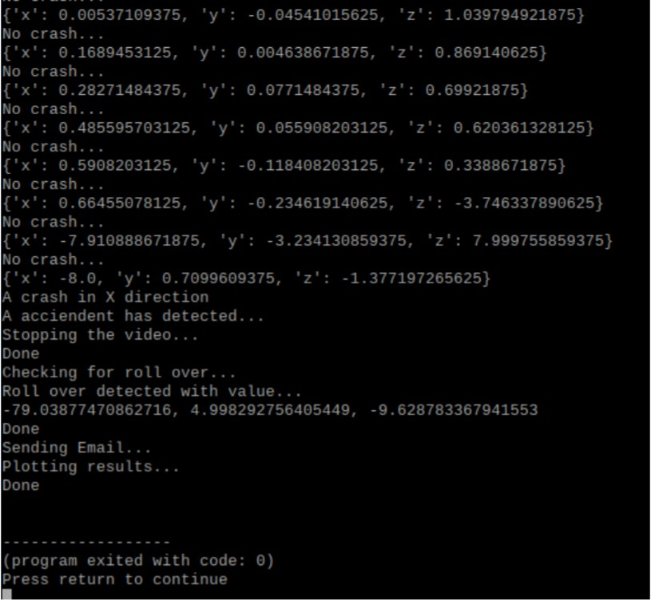
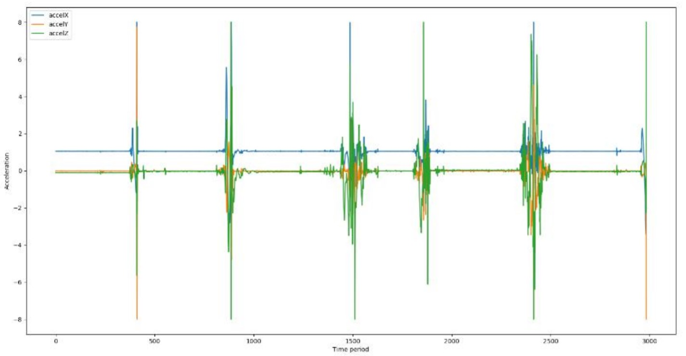
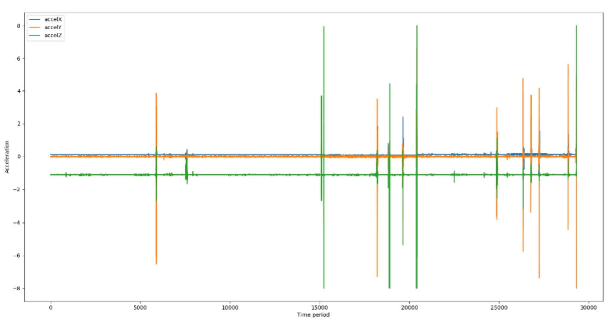
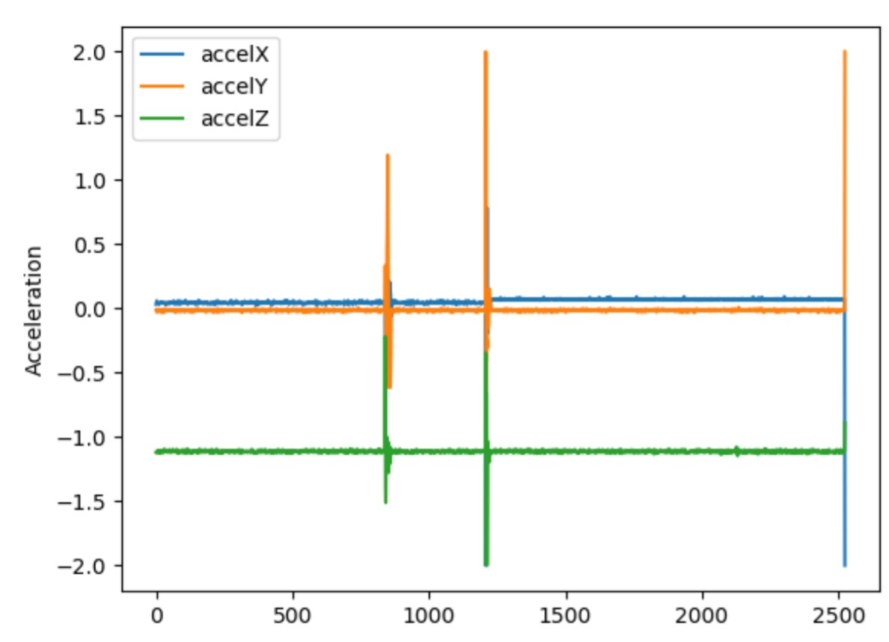
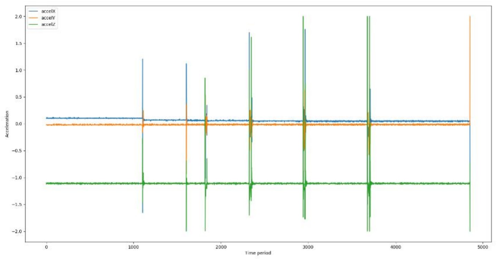

# Car crash detection
---
## A car accident detection system based on Arduino UNO, MPU-6050 Accelerometer + Gyro and a webcam.
These python scripts primarily act as a backbone for the entire car accident detection system, ploting the results (using **matplotlib**), recording the crash video(using **cv2**) and sending an alert to the relevant authorities(using **smtplib**).
 
#### Script:

 
#### MPU6050 output acceleration against time for a threshold value and a full-scale range of 8G:

 
#### MPU6050 output acceleration against time for a threshold value and a full-scale range of 8G:

 
#### MPU6050 output acceleration against time for a threshold value and a full-scale range of 2G:

 
#### MPU6050 output acceleration against time for a threshold value and a full-scale range of 2G

